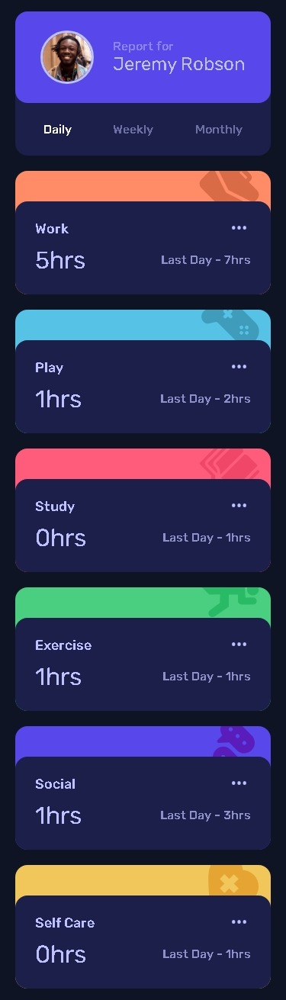
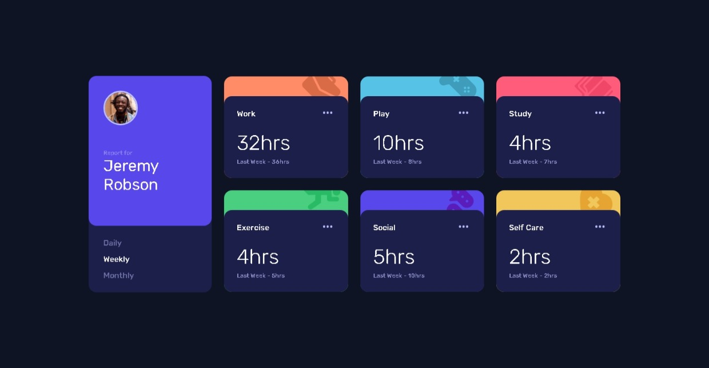
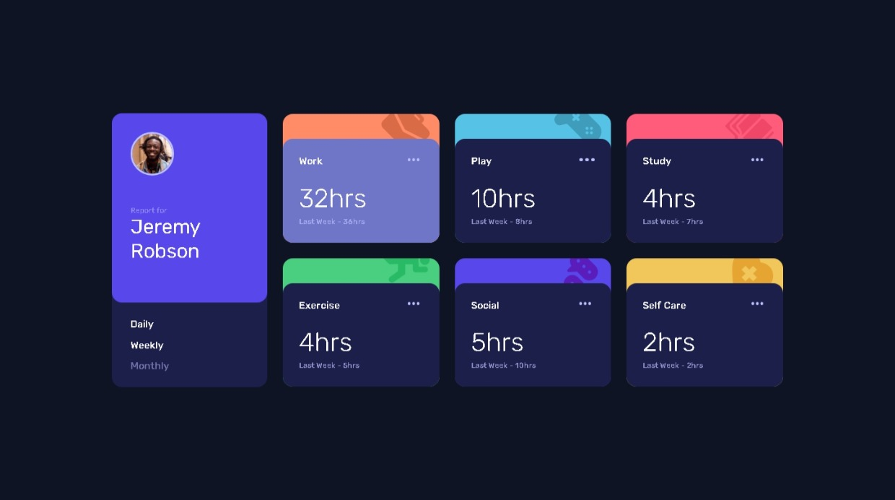

# Frontend Mentor - Time tracking dashboard main

This is a solution to the [time-tracking-dashboard on Frontend Mentor](https://github.com/gillaercio/time-tracking-dashboard-main). Frontend Mentor challenges help you improve your coding skills by building realistic projects

## Table of contents

- [Overview](#overview)
  - [Screenshot](#screenshot)
  - [Links](#links)
- [My process](#my-process)
  - [Built with](#built-with)
  - [What I learned](#what-i-learned)
  - [Continued development](#continued-development)
- [Author](#author)

## Overview

### Screenshot

These are my screenshots showing how the project turned out.

- Mobile design:



- Desktop design:



- Active states:



### Links

- Solution URL: [My Solution](https://github.com/gillaercio/time-tracking-dashboard-main)

## My process

### Built with

- Semantic HTML5 markup
- CSS custom properties
- Flexbox
- CSS Grid
- Mobile-first workflow
- JavaScript
- JSON

### What I learned

I took advantage of this project to practice using **BEM** with HTML, **Reset CSS** and  **Variables** with **CSS** and **JSON** and **DOM** with **JavaScript**:

BEM (Block Element Modifier)

```html
<nav class="profile__nav">
  <ul class="profile__menu">
    <li>
      <button
        class="profile__menu-item"
        aria-pressed="false"
        data-timeframe="daily">
        Daily
      </button>
    </li>
    <li>
      <button
        class="profile__menu-item profile__menu-item--active"
        aria-pressed="true"
        data-timeframe="weekly">
        Weekly
      </button>
    </li>
    <li>
      <button
        class="profile__menu-item"
        aria-pressed="false"
        data-timeframe="monthly">
        Monthly
      </button>
    </li>
  </ul>
</nav>
```

Reset CSS

```css
*,
*::before,
*::after {
  margin: 0;
  padding: 0;
  box-sizing: border-box;
}
```

Variables

```css
:root {
  --Navy-950: hsl(226, 43%, 10%);
  --Navy-900: hsl(235, 46%, 20%);
  --Purple-500: hsl(235, 45%, 61%);
  --Navy-200: hsl(236, 100%, 87%);
  --White: hsl(0, 100%, 100%);

  --rubik: 'Rubik', sans-serif;

  --text-sm: 500 1.6rem/120% var(--rubik);
  --text: 2.4rem/120% var(--rubik);
  --text-title: 500 1.8rem/120% var(--rubik);
  --text-lg: 3.2rem/120% var(--rubik);
}
```

JSON

```js
let dataGlobal = [];

const menuButtons = document.querySelectorAll(".profile__menu-item");
const cards = document.querySelectorAll(".card");

document.addEventListener('DOMContentLoaded', () => {
  fetch("assets/data/data.json")
    .then(response => response.json())
    .then(data => {
      dataGlobal = data;
      updateUI("weekly");
    });
});
//...
```

DOM

```js
// ...
function updateUI(timeframe) {
  cards.forEach((card, index) => {
    const current = dataGlobal[index].timeframes[timeframe].current;
    const previous = dataGlobal[index].timeframes[timeframe].previous;

    card.querySelector(".card__hours").textContent = `${current}hrs`;

    card.querySelector(".card__previous").innerHTML =
     `Last ${getLabel(timeframe)} - ${previous}hrs`;
  });
}
//...
```

### Continued development

I would like to improve the use of the **HTML**, **CSS** and **JavaScript**.

## Author

- Frontend Mentor - [@gillaercio](https://www.frontendmentor.io/profile/gillaercio)
- Github - [My Github](https://github.com/gillaercio)
- LinkedIn - [My LinkedIn](https://www.linkedin.com/in/gildman-la%C3%A9rcio/)